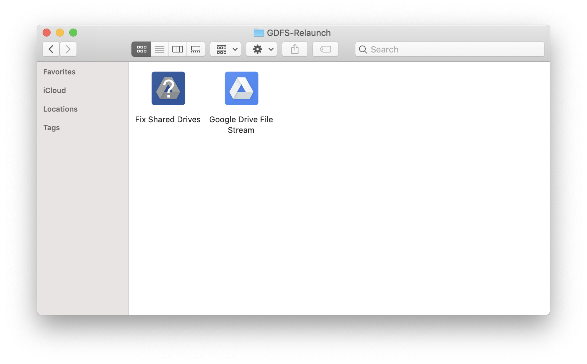
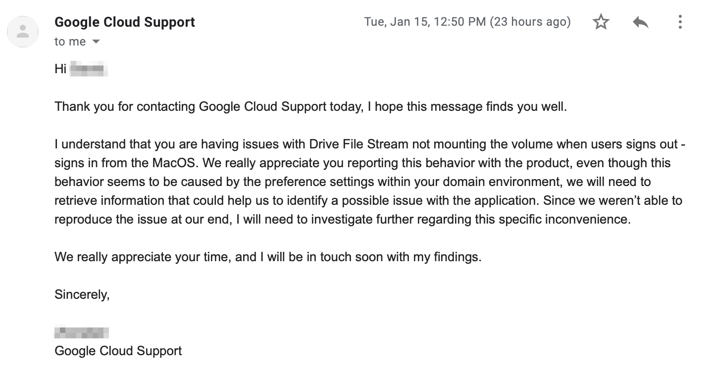

# GDFS-Relaunch

This is an application with one simple job, and that is to relaunch Google Drive File Stream (hereinafter GDFS) on macOS.



## Why did I create this?

The short version of the story is, when you log off of your user account on macOS High Sierra 10.13.6, GDFS version 29.1.23.2047 has a bug that causes the Google Drive volume to become unmounted overnight. Upon logging in the next morning, you find GDFS “running”, but the Google Drive volume missing, and files therefore inaccessible. I haven’t been able to find a way to reproduce the bug, it seems to happen randomly every few days for different users on a different hosts. I quickly found myself inundated with Helpdesk calls and unhappy users with lots of downtime.

GSuite support was useless when I contacted them about the issue. I sent them log files from 4 different occurrences of this bug from various hosts and various users. They initially told me they would look into the issue and that my configuration looks good. They “looked into the log files further” and didn’t offer any resolution. When I demanded they escalate the issue and help get it resolved, as it’s causing lots of downtime for the end users, they told me that this issue is not of high priority as they haven’t received many complaints about this issue and those that they had received, were deemed to be caused by some so-called “preference settings” on the client side. They “escalated” the issue, and I received this response.



The only way to fix the issue that I’ve found is to quit and relaunch GDFS.
That’s where GDFS-Relaunch comes in!

## How it works

This all started with a simple bash script that I wrote:

```bash
#!/bin/bash

killall "Google Drive File Stream" && killall "Google Drive File Stream Helper"

sleep 2

open /Applications/Google\ Drive\ File\ Stream.app

kill -9 $(ps -p $(ps -p $PPID -o ppid=) -o ppid=)
``` 

When run from terminal, it kills all GDFS and GDFS helper processes, sleeps for 2 seconds for them to quit, then launches the GDFS app (assuming it is installed in the default location, /Applications/), and then quits terminal. Initially, I was going to run this script remotely when a user experienced the issue, but it started happening so frequently, I needed a self service option.

I used [appify](https://gist.github.com/mathiasbynens/674099) to wrap my script in a macOS application, and quickly mocked up a self explanatory icon for it based on that of GDFS. You can stop here and have a working app, but I needed to deploy this via Apple Remote Desktop (hereinafter ARD), and wanted the users to have a convenient icon in their Dock so they didn’t have to go digging around in /Applications/ (which would inevitably end in another Helpdesk call from some of my less savvy users).

I proceeded to use [Packages](http://s.sudre.free.fr/Software/Packages/about.html) to make a simple Raw installer package that can be deployed via ARD. I have the installer place the .app that I created with appify, into /Applications/. Then, to add the application to the user’s Dock, we just have to run a simple bash script that I called “Shared_Fix_Dock.sh” as the user whose Dock we want to modify.

```bash
#!/bin/bash

sudo -u $USER

defaults write com.apple.dock persistent-apps -array-add '<dict><key>tile-data</key><dict><key>file-data</key><dict><key>_CFURLString</key><string>/Applications/Fix Shared Drives.app</string><key>_CFURLStringType</key><integer>0</integer></dict></dict></dict>'

killall Dock
```

The problem is, the installer must run as root/admin to place the .app into the /Applications/ folder. If the installer runs as root/admin, then the post install script does as well. This would add the .app to the root/admin user’s Dock, not the user currently logged in. To fix this, we put our “Shared_Fix_Dock.sh” in the /Contents/Resources folder of the .app that we created with appify. Then, we create a simple post install script called “RunAsUser.sh” that launches the “Shared_Fix_Dock.sh” as the user that is currently logged in.

```bash
#!/bin/bash

sudo -u $USER /Applications/Fix\ Shared\ Drives.app/Contents/Resources/Shared_Fix_Dock.sh
``` 

The $USER variable comes from the installer package, for those of you who might be wondering.

## Install

For those of you who are adventurous, you can follow the “How it works” section above, and build your own version of this nifty little app. For those who need a built copy of it to hit the ground running and appease your users, just download the “FixGDFS.pkg” file, and deploy to your hosts.

One caveat is, the package only adds the app to the Dock of the user that is currently logged in when it is deployed. The process of adding the app to the Dock will kill the Dock, and cause all of the user’s minimized windows to pop back up. You can make changes to have this app added to all user’s Docks, or to not kill the Dock during install, and maybe even schedule a Cronjob to reboot the system or relaunch the Dock for a later time depending on your requirements.

## Usage

Just launch the “Fix Shared Drives.app” from the Dock, or /Applications/ folder to relaunch GDFS, and hopefully fix the problem.

# Disclaimer

I obviously provide no warranties, and am not liable for any damage or unexpected behavior caused by anything provided here. Behavior may change with future updates, so always do your own QA testing on a non-vital system or disposable VM.

I don’t recommend installing random .pkg files found on the internet, unless you know what they’re doing to your system. Checkout [Suspicious Package](https://www.mothersruin.com/software/SuspiciousPackage/get.html) to see what’s inside those .pkg files. 
